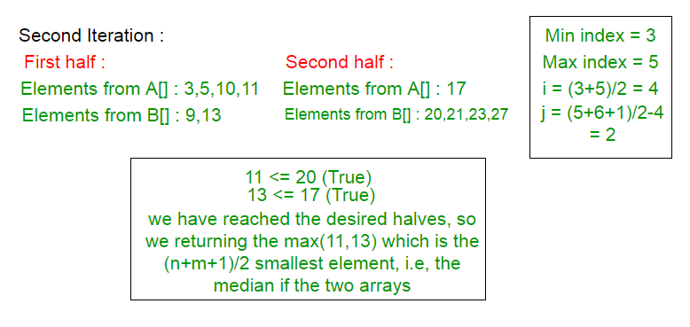
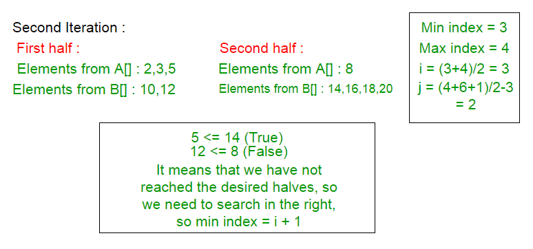
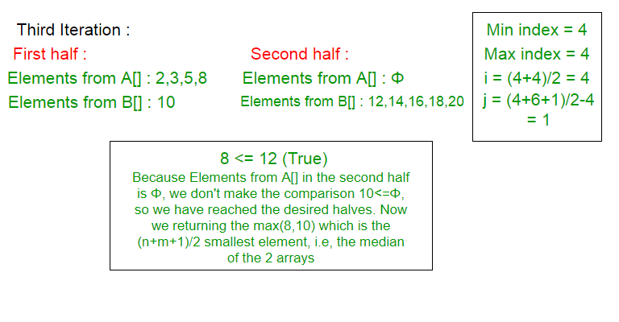

[Median of two sorted arrays with different sizes in `O(log(min(n, m)))`](https://www.geeksforgeeks.org/median-two-sorted-arrays-different-sizes-ologminn-m/)
=========================================================================

Given two sorted arrays, `a[]` and `b[]`, task is to find the median of these
sorted arrays, in `O(log(min(n, m))`, when `n` is the number of elements in the
first array, and `m` is the number of elements in the second array.

Examples
--------
```
Input : ar1[] = {-5, 3, 6, 12, 15}
        ar2[] = {-12, -10, -6, -3, 4, 10}
        The merged array is :
        ar3[] = {-12, -10, -6, -5 , -3,
                 3, 4, 6, 10, 12, 15}
Output : The median is 3.
```

```
Input : ar1[] = {2, 3, 5, 8}
        ar2[] = {10, 12, 14, 16, 18, 20}
        The merged array is :
        ar3[] = {2, 3, 5, 8, 10, 12, 14, 16, 18, 20}
        if the number of the elements are even, 
        so there are two middle elements,
        take the average between the two :
        (10 + 12) / 2 = 11.      
Output : The median is 11.
```

Note:
 - In case of even numbers in total and if we want to return a median
   that exist in the merged array we can return the element in the
   `(n+m)/2` or `(n+m)/2 – 1` position. In that case the median can
   be 10 or 12.

Approach
--------
Start partitioning the two arrays into two groups of halves (not two
parts, but both partitioned should have same number of elements).
The first half contains some first elements from the first and the second
arrays, and the second half contains the rest (or the last) elements form
the first and the second arrays. Because the arrays can be of different sizes,
it does not mean to take every half from each array. The below example
clarifies the explanation. Reach a condition such that, every element
in the first half is less than or equal to every element in the second half.

How to reach this condition?
----------------------------

Example in the case of even numbers. Suppose, partition is found. Because `A[]`
and `B[]` are two sorted arrays, `a1` is less than or equal to `a2`, and `b2`
is less than or equal to `b3`. Now, to check if `a1` is less than or equal to `b3`,
and if `b2` is less than or equal to `a2`. If that’s the case, it means that every
element in the first half is less than or equal to every element in the second half,
because, `a1` is greater than or equal to every element before it (`a0`) in `A[]`,
and `b2` is greater than or equal to every element before it (`b1` and `b0`) in `B[]`.

In case of even numbers in total the median will be the average between max of `a1`, `b2`
and the min of `a2`, `b3`, but in case of odd numbers in total the median will be the
max of `a2`, `b2`. But if it is not these two cases, there are two options (in referring
to the even numbers example): `b2 > a2` or `a1 > b3` if, `b2 > a2` it means that, search
on the right side of the array, and if `a1 > b3` it means that, search on the left side
of the array, until desired condition is found.


Why the above condition leads to the median?
--------------------------------------------

The median is the `(n + 1) / 2` smallest element of the array, and here, the median is the
`(n + m + 1) / 2` smallest element among the two arrays. If, all the elements in the first
half are less than (or equal) to all elements in the second half, in case of odd numbers
in total, just calculate the maximum between the last two elements in the first half
(`a2` and `b2` in our example), and this will lead us to the `(n + m + 1) / 2` smallest
element among the two arrays, which is the median `((7 + 4 + 1) / 2 = 6)`. But in case of
even numbers in total, calculate the average between the maximum of the last two elements
in the first half (`a1` and `b2` in our example) with its successive number among the arrays
which is the minimum of first two elements in the second half (`a2` and `b3` in our example).

The process of the partition
----------------------------

To make two halves, make the partition such that the index that partitioning array `A[]` +
the index that partitioning array `B[]` are equal to the total number of elements plus one
divided by `2`, i.e. `(n + m + 1) / 2` (`+1` is, if the total number of elements is odd).

First, define two variables: `min_index` and `max_index`, and initialize `min_index` to `0`,
and `max_index` to the length of the smaller array. In these below examples `A[]` is the
smaller array.

To partition `A[]`, use the formula `(min_index + max_index) / 2` and insert it to a variable
`i`. To partition `B[]`, use the formula `(n + m + 1) / 2 – i` and insert it to a variable `j`.

The variable `i` means the number of elements to be inserted from `A[]` into the first half,
and `j` means the number of elements to be inserted from `B[]` into the first half, the rest
of the elements will be inserted into the second half.

Take a look at the below examples:

**Example 1**




**Example 2** (This example refers to the condition that returns a median that exists in the
merged array):




